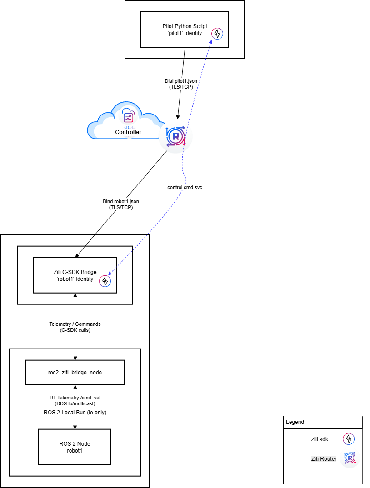

# Secure ROS 2 Teleop via NetFoundry OpenZiti

This repository provides an example **Zero Trust, identity-based** remote control and telemetry system for ROS 2 based robots. By bridging the ROS 2 bus with an **OpenZiti** overlay network, it eliminates the need for VPNs, open firewall ports, or static IPs. Most remote ROS 2 architectures attempt to "stretch" the local network across a VPN, forcing the remote controller to act as a full ROS 2 node. This approach is plagued by DDS Multicast limitations, high overhead, and extreme sensitivity to internet latency.

This project introduces a "Bridge-as-Controller" architecture that fundamentally decouples the robot’s physics from the remote command layer.

Instead of treating the remote pilot as a peer node on the ROS graph, our C++ Ziti Bridge acts as the local "Guardian" on the robot’s hardware. It manages all high-frequency ROS 2 topics (/joint_states, /cmd_vel) locally, ensuring real-time stability regardless of the quality of the internet connection.
By translating the chatty, broadcast-heavy ROS 2 environment into a streamlined, identity-driven stream, we achieve three critical breakthroughs:

* **Multicast Isolation:** The "broadcast storms" of DDS discovery are trapped on the robot’s local bus. The remote link remains a clean, point-to-point tunnel.

* **Zero-Trust "Dark" Robots:** The robot is invisible to the public internet. It maintains no open inbound ports and only accepts specific, authenticated JSON commands through the OpenZiti fabric.

* **Version Independence:** Because the control link is a lean JSON API, your remote pilot is "Universal." It can control different robots running different ROS 2 versions (e.g., Jazzy, Humble, or Foxy) simultaneously from a single Python script or dashboard.

* **Network Isolation:** The robot's ROS 2 stack is effectively **darkened** to the public internet and local LAN, communicating only via authenticated, outbound-only encrypted tunnels.


## 🏗️ Architecture
* **Pilot (Remote):** A lightweight Python controller requiring **zero ROS 2 dependencies**.
* **Robot Bridge (Local):** A C++ node translating Ziti-native JSON into ROS 2 messages.
* **Networking:** Discovery logic that can be isolated to a single robot or extended to an entire fleet via a Gateway model.
* **Naming**: Namespace and ziti identity should match on the bridged Robots. 



---

## 🔒 Networking: "Dark Robot"

We use `rmw_cyclonedds_cpp` to move the security perimeter from the network hardware to the **OpenZiti Identity**. This allows for two distinct deployment models:

### 1. The "Dark Robot" (Isolated) (default setup)
* **Binding:** The `CYCLONEDDS_URI` restricts all traffic to the loopback (`lo`) interface.
* **Result:** No ROS 2 traffic leaves the machine. The OpenZiti Bridge is the only "eye" into the robot.

---

## 🛠️ System Requirements

[!IMPORTANT]

**Operating System:** Ubuntu 24.04 LTS (Noble Numbat)  
**ROS 2 Distribution:** Jazzy Jalisco  

---

##  Deployment & Build

### 1. Robot Environment

```bash
export ROS2_WS=~/ros2_ws
mkdir -p $ROS2_WS/src
cd $ROS2_WS/src
sudo apt install -y git
git clone https://github.com/netfoundry/ziti_ros2_bridge_repo.git
cd ziti_ros2_bridge_repo/scripts
chmod +x setup_robot.sh
./setup_robot.sh && source ~/.bashrc
```
### 2. OpenZiti C-SDK Build & Deployment
The Bridge requires the Ziti C-SDK. We build this from source to ensure all transport dependencies (`tlsuv`, `libuv`) are statically linked or globally available for the ROS 2 build:

```bash
chmod +x install_ziti_sdk.sh
./install_ziti_sdk.sh
```

### 3. build ziti_ros2_bridge

```bash
cd $ROS2_WS
colcon build --packages-select ziti_ros2_bridge
grep -qxF "source $ROS2_WS/install/setup.bash" ~/.bashrc || echo "source $ROS2_WS/install/setup.bash" >> ~/.bashrc
source ~/.bashrc
```

### 3. Setup the remote control VM env

On your vm/workstation where you will remotely control the robot
```bash
# Install system dependencies
sudo apt update
sudo apt install -y python3-venv python3-pip git

# Setup repository
mkdir -p ~/repos && cd ~/repos
if [ ! -d "ziti_ros2_bridge_repo" ]; then
    git clone https://github.com/netfoundry/ziti_ros2_bridge_repo.git
fi
cd ziti_ros2_bridge_repo/scripts

# Create and initialize the virtual environment
python3 -m venv control
source control/bin/activate

# Install the OpenZiti Python SDK and dependencies
pip install openziti
```

## Setup the NetFoundry Openziti overlay network Environment

## 🌐 Cloud Connectivity (NetFoundry)

This demo utilizes a **NetFoundry Managed Network** to provide a secure, global zero-trust overlay.

1. **NetFoundry Network:** Create a NetFoundry Network with at least one **NF Hosted Edge Router** in the same geographic region as the Robot and control sites.
2. **Identity Creation:** Create two identities in the NetFoundry Console (`pilot1` and `robot1`).
3. **Service Config:** Define a **SDK-to-SDK service** named `control.cmd.svc` (a Service with no configs attached).
4. **Service Policies:** 
    * Create a **Dial Policy** linking the `pilot1` identity to the `control.cmd.svc`.
    * Create a **Bind Policy** linking the `robot1` identity to the `control.cmd.svc`.
5. **Edge Router Policies:** Ensure both SDKs/Endpoints are added to an **Edge Router Policy** that includes the **NF Hosted Edge Router**.
6. **Identity Enrollment:**
    * Download the JWTs for both endpoints from the NetFoundry Console.
    * Enroll them using the latest [OpenZiti CLI](https://github.com/openziti/ziti):
      ```bash
      ziti edge enroll pilot1.jwt -o pilot1.json
      ```
    * Place the resulting `.json` files in the `$HOME` folder on each respective machine.

## Test Service Connectivity

1. **Robot1:** Start the bridge and demo ros2 robot in two separate terminals
* **Start Bridge terminal 1:** 
    ```bash
    source ~/.bashrc
    ros2 run ziti_ros2_bridge ziti_bridge_node --ros-args  -p ziti_context_path:=$HOME/"robot1.json" -p ziti_identity_name:="robot1"  -p ziti_service_name:="control.cmd.svc" -r __node:=ziti_bridge
    ```
* **Start robot1 terminal 2:** 
    ```bash
    source ~/.bashrc
    cd $ROS2_WS/src/ziti_ros2_bridge_repo/scripts
    python3 demo_robot.py --namespace robot1
    ``` 
* **Note:** At this point, the python script will indicate there is no link because we have not started to send Teleop from the pilot yet:
    ```bash
    [ERROR] [1772995069.410012235] [robot1.demo_robot_driver]: WATCHDOG: Link Lost!
    ```  

2. **pilot1:** Start the demo pilot in a terminal
* **Start pilot1 terminal:**
    ```bash
    cd ~/repos/ziti_ros2_bridge_repo/scripts
    source control/bin/activate
    python3 demo_controller.py --id_json ~/pilot1.json --primary_gw robot1 --ns robot1 --service control.cmd.svc
    ``` 
    * **ctrl-c** to exit

    **Expected output pilot terminal:**
    ```text
    [Dials] robot1...
    [System] Connected
    [robot1] robot1 |    0.99 rad |     56.7° |   0.2 Turns
    ```      
    **Expected output robot terminal 2:**
    ```text
    [INFO] [1772995068.344474219] [robot1.demo_robot_driver]: Recv: LX: 0.20, AZ: 0.10
    [INFO] [1772995068.397960420] [robot1.demo_robot_driver]: Recv: LX: 0.20, AZ: 0.10
    [INFO] [1772995068.452111645] [robot1.demo_robot_driver]: Recv: LX: 0.20, AZ: 0.10
    [INFO] [1772995068.505224948] [robot1.demo_robot_driver]: Recv: LX: 0.20, AZ: 0.10
    [INFO] [1772995068.558909114] [robot1.demo_robot_driver]: Recv: LX: 0.20, AZ: 0.10
    [INFO] [1772995068.612223646] [robot1.demo_robot_driver]: Recv: LX: 0.20, AZ: 0.10
    [INFO] [1772995068.665046933] [robot1.demo_robot_driver]: Recv: LX: 0.20, AZ: 0.10
    [INFO] [1772995068.718243133] [robot1.demo_robot_driver]: Recv: LX: 0.20, AZ: 0.10
    [INFO] [1772995068.772033330] [robot1.demo_robot_driver]: Recv: LX: 0.20, AZ: 0.10
    [INFO] [1772995068.824998486] [robot1.demo_robot_driver]: Recv: LX: 0.20, AZ: 0.10
    [INFO] [1772995068.859973817] [robot1.demo_robot_driver]: Recv: LX: 0.00, AZ: 0.00
    ...
    ...
    [ERROR] [1772995069.410012235] [robot1.demo_robot_driver]: WATCHDOG: Link Lost! #After you exit pilot script
    ```


### Appendix

### (Optional) The "Fleet Gateway" (Subtending Robots) 
In this mode, the Ziti-enabled robot acts as a **Secure Ingress** for other robots on the same local subnet that do **not** have their own Ziti identities. Direct commands to them by namespace.
* **Gateway Logic:** The Bridge listens on both `lo` (for the host) and a physical interface (e.g., `wlan0`).
* **Subtending Access:** To ensure the gateway actively finds and communicates with other robots on the LAN, the <Discovery> block with explicit <Peers> is required.
* **Interface Inclusion:** You must update the `CYCLONEDDS_URI` to include the physical network interface:
* **CycloneDDS interface bindings** are persistent at the OS level. If you modify your CYCLONEDDS_URI to enable or disable a physical LAN interface, simply re-sourcing your .bashrc or restarting individual nodes is insufficient.
    - Reboot Required for Changes: When adding or removing a physical interface (like wlan0) from the XML, a full system reboot is required. 
      This ensures the  kernel correctly initializes multicast groups and joins the discovery mesh on the specified interfaces from a clean state.

* Update the CYCLONEDDS_URI in you ~/.bashrc like example below and **Reboot Robot**
```xml
export CYCLONEDDS_URI='<CycloneDDS>
  <Domain>
    <General>
      <Interfaces>
        <NetworkInterface name="lo"/>
        <NetworkInterface name="wlan0"/>
      </Interfaces>
    </General>
    <Discovery>
      <Peers>
        <Peer address="239.255.0.1"/>
      </Peers>
    </Discovery>
  </Domain>
</CycloneDDS>'
```

